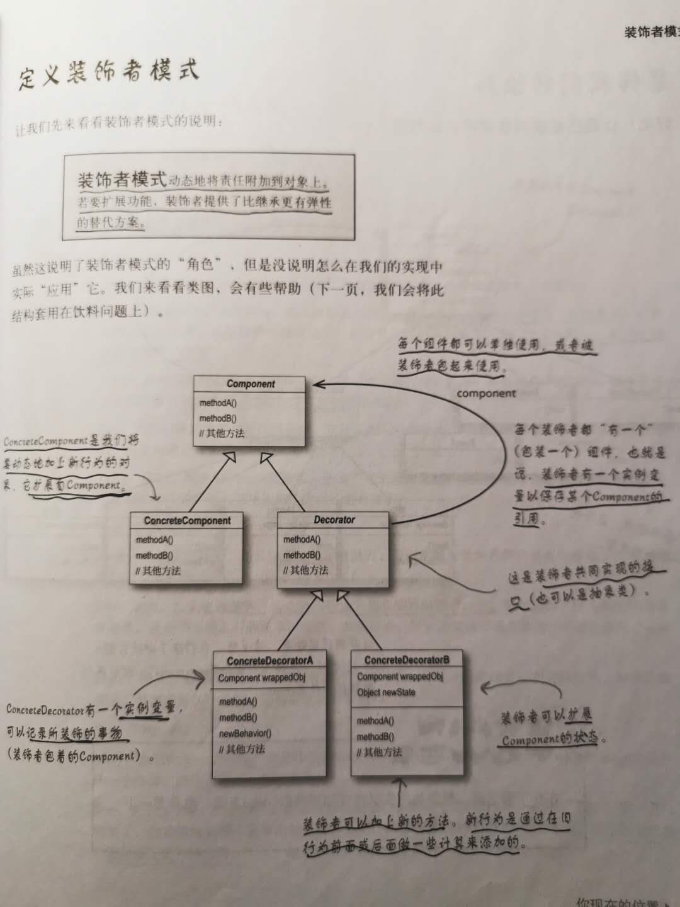
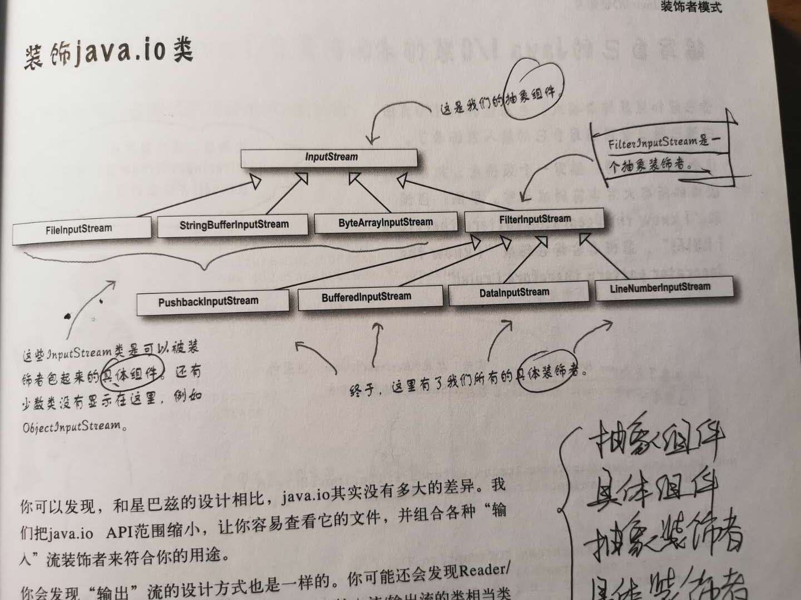

# 装饰者模式 Decorator Pattern
### 装饰者模式动态的将责任附加到对象上。若要扩展功能，装饰者提供了比继承更有弹性的替代方案。

+ 装饰者意味着一群装饰者类，这些类用来包装具体组件。
+ 装饰者反映出被装饰的组件类型（事实上，他们具有相同的类型，都经过接口或继承实现）。
+ 装饰者可以再被装饰者的行为前面与/或后面加上自己的行为，甚至将被装饰者的行为整个取代掉，而达到特定的目的。
+ 装饰者会导致设计中出现许多小对象，如果过度使用，会让程序变得很复杂。

### Java IO
